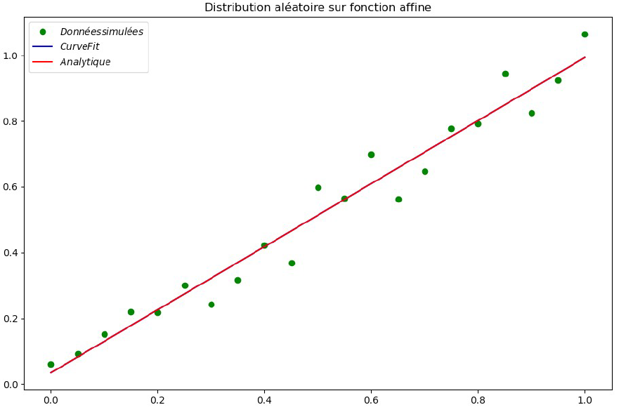
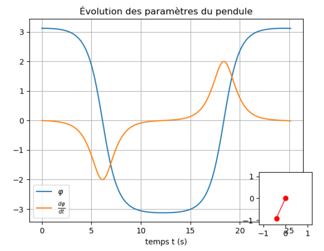
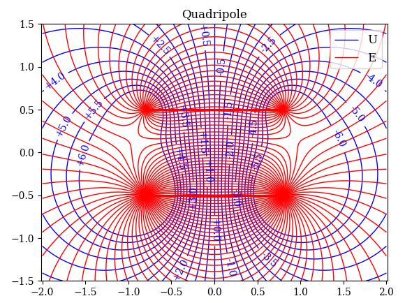

# Cours_Modelisation

"""
@author: Yoann Mollier
"""

Ajout des 8 TD  du cours de Modélisation informatique suivi en L3 Physique Chimie

TD 1 - Introduction à Python
Brève introduction aux différentes fonctionnalités du langage et des opérations classiques.
Élaboration d'une fonction d'écart type et analyse de quelques données expérimentales pour se familiariser
avec l'ordre des opérations et la gestion des array et tuples. 

TD 2 - Ajustement des mesures par une courbe théorique
Introduction aux outils scientifiques proposés par python, avec scipy et matplotlib.
Ajout d'une courbe expérimentale, comparaison avec une première approximation à main levée,
puis fitting de la courbe avec curve_fit()
Génération également d'une courbe de tendance sur une fonction linéaire sur laquelle on a ajouté un bruit artificiel

TD 3 - Équations différentielles ordinaires
Brève utilisation d'odeint() sur le problème du pendule, 
introduction également aux animations avec le module animation de matplotlib

TD 4 - Oscillations et résonance
Étude physique du problème de l'oscillateur harmonique et oscillateur harmonique forcé
Différentes méthodes de construction de graphiques avec notamment l'insertion du diagramme de phase
Comparaison dans un dernier temps avec des données expérimentales pour vérifier nos différentes modélisations

TD 5 - Paquet d'ondes (vitesse de phase, vitesse de groupe et dispersion)
Comprendre les effets des divers paramètres associés aux paquet d'ondes,
Animation de notre paquet d'onde en prenant en compte les déformations qu'il peut subir

TD 6 - Électrostatique 2D
Utilisation de la méthode complexe pour afficher les lignes de champs issus de charges ponctuelles
Puis comparaison de notre méthode numérique avec des valeurs de tensions mesurées au bornes d'un condensateur

TD 7 - Isothermes de l'équation d'état de van der Waals
Construction d'un graphique d'isotherme en fonction de V et de T,
Ce diagramme nous permet ensuite de construire les paliers de Maxwell pour différentes températures,
jusqu'à la température critique

TD 8 - Lois de Kepler
Dernier TP sur les lois de Kepler, permettant une approche du comportement d'une planète en orbite autour du soleil
en simulant sa trajectoire et son hodographe au cours de son orbite
